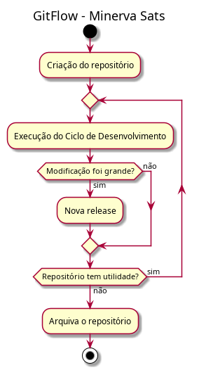
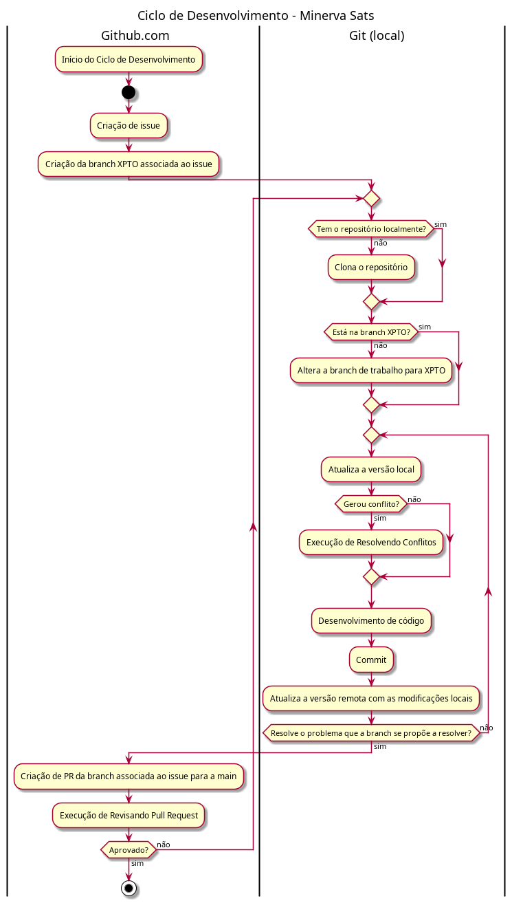
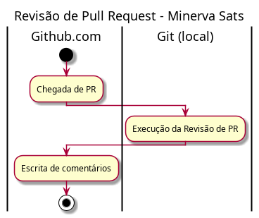

# 🛰️ Guia de Contribuição — Minerva Aeroespacial 🚀

Este guia explica como contribuir de forma rápida e consistente.

---

## 🚀 Como Contribuir

1. **Crie uma Issue**:  
   No GitHub, vá em `Issues` > `New issue` e descreva o que você quer fazer (feature, bugfix, melhoria) e salve.

2. **Crie uma Branch**:  
   Abra a página do issue (abre automaticamente quando é criado) e, em `Development`, clique em `Create a branch`. Mantenha o nome padrão, deve ser parecido com `42-adicionar-modulo-telemetria`.

   E execute os comandos para alterar a branch localmente na sua máquina:
   ```bash
   git fetch origin
   git checkout -b <numero-da-issue>-<titulo>
   ```

3. **Faça Commits**:  
   Use mensagens de commit claras:  
   ```bash
   feat(sensor): adicionar módulo de telemetria
   ```

4. **Crie um Pull Request**:  
   Nomeie o PR com referência à issue:  
   ```
   PR#42: Adicionar módulo de telemetria
   ```

5. **Tests & Reviews**:  
   Teste seu código e aguarde a revisão antes do merge.

---

## 🧩 Convenções

### 🔀 Branches

```bnf
<nome-da-branch> ::= <numero-da-issue>-<titulo>

<numero-da-issue> ::= <digito> {<digito>}
<titulo> ::= <lowercase> {<lowercase> | "-"}

<digito> ::= "0" | "1" | "2" | "3" | "4" | "5" | "6" | "7" | "8" | "9"
<lowercase> ::= "a" | "b" | "c" | ... | "z"
```
**Exemplo**: `14-corrigir-bug-calculo-orbita`

### 📜 Commits

```bnf
<mensagem> ::= <tipo>(<escopo>): <descrição>

<tipo>      ::= "feat" | "fix" | "docs" | "style" | "refactor" | "test" | "chore"
<escopo>    ::= <palavra>
<descrição> ::= <palavra> {<palavra>}

<palavra> ::= <lowercase> {<lowercase>}
```

- **Exemplo**: `fix(antena): corrigir indexação`

### 🔧 Pull Requests

```bnf
<nome-do-pr> ::= "PR#" <numero-da-issue> ":" <descrição>
<descrição> ::= <palavra> {<palavra>}
```
**Exemplo**: `PR#27: Melhorar algoritmo de navegação`

---

## 📊 Diagramas de GitFlow

Aqui estão os diagramas de sequência para nossos processos de contribuição:

- **Gitflow Geral**:  
  

- **Ciclo de Desenvolvimento**:  
  

- **Revisando Pull Request**:  
  

### Compilando os Diagramas

Eles foram feitos usando o PlantUML. Para compilar, basta instalar o PlantUML com `sudo apt install PlantUML -y` e executar o comando `make` para buildar as imagens.

- Se quiser uma documentação melhor de como compilar, sugiro o [repositório de diagramas de COM](https://github.com/minervarockets/pmm-com-activity-diagrams).

- Se quiser saber como criar um diagrama, veja o site do [PlantUML](https://plantuml.com/activity-diagram-beta).
---

## 🛰️ Vamos Lançar Código!

Obrigado por contribuir com a **Minerva Sats**! Se tiver dúvidas, fale com sua gerência ou dê um grito no Discord.
**Avante!** 🚀🛰️ 
